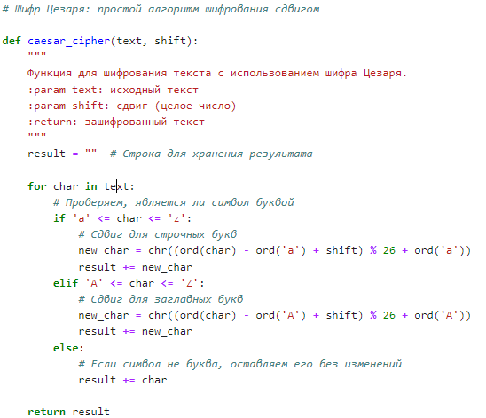
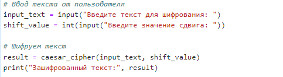
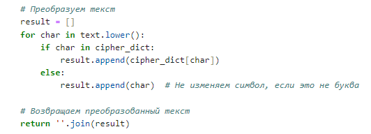
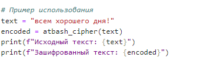

---
## Front matter
lang: ru-RU
title:  Лабораторная работа №1
subtitle: Презентация
author:
  -  Миличевич Александра
institute:
  - Российский университет дружбы народов, Москва, Россия
  
date: 15 февраля 2025

## i18n babel
babel-lang: russian
babel-otherlangs: english

## Formatting pdf
toc: false
toc-title: Содержание
slide_level: 2
aspectratio: 169
section-titles: true
theme: metropolis
header-includes:
 - \metroset{progressbar=frametitle,sectionpage=progressbar,numbering=fraction}
 - '\makeatletter'
 - '\beamer@ignorenonframefalse'
 - '\makeatother'
---

# Цель работы

Познакомиться с шифрами Цезаря и Атбаш.

---

# Задание

1. Реализовать шифр Цезаря с произвольным ключом k.
2. Реализовать шифр Атбаш.

---

#  Выполнение лабораторной работы

---

##  Шифр Цезаря 

Шифр Цезаря — это один из самых простых и известных методов шифрования, который основан на сдвиге букв алфавита на фиксированное количество позиций. Например, при сдвиге на 3 буква "A" становится "D", "B" — "E" и так далее, 
что делает его легко реализуемым, но уязвимым для криптоанализа. Несмотря на свою простоту, 
шифр Цезаря служит основой для более сложных методов шифрования и часто используется в образовательных целях для объяснения принципов криптографии.

---

1) Этот код реализует шифр Цезаря для шифрования текста. Он сдвигает каждую 
букву на указанное число позиций в алфавите, сохраняя регистр (заглавные или строчные). Все остальные символы,
 такие как цифры или знаки препинания, остаются без изменений. Формула `(ord(char) - ord('a') + shift) % 26 + ord('a')` используется для преобразования букв: она вычисляет позицию
 буквы в алфавите, добавляет сдвиг, возвращает результат в диапазон от 0 до 25 (циклично) и преобразует обратно в символ.
 
 
 ---

{ width=70% }

---

Этот код запрашивает у пользователя текст и значение сдвига, затем вызывает функцию `caesar_cipher` для шифрования текста и выводит результат на экран.

{ width=70% }

---

## Атбаш 

Атбаш — это древний метод шифрования, который заключается в замене каждой буквы алфавита на букву, 
симметрично расположенную относительно его середины. 
Например, в латинском алфавите буква "A" заменяется на "Z", "B" на "Y", и так далее.
 Этот шифр использовался в исторических текстах и является одним из простейших методов шифрования.

---

###  3) Создание перевернутого алфавита

В строке `reverse_alphabet = alphabet[::-1]` создается перевернутый алфавит, где буквы идут в обратном порядке. Затем с помощью генератора словаря `cipher_dict` для каждой буквы из оригинального алфавита создается пара, сопоставляющая её с буквой из перевернутого алфавита.

---

{ width=70% }

---

###  4) Основной цикл шифрования

Этот код перебирает каждый символ в строке `text` (приведенной к нижнему регистру). Если символ — буква, она заменяется по словарю `cipher_dict`; если нет (например, пробел или знак препинания), символ остается без изменений. Все измененные символы собираются в список `result`, который затем объединяется в строку и возвращается.

---

{ width=70% }

---

###  5) Вывод результата

Код шифрует строку `text` с помощью функции `atbash_cipher` и выводит исходный и зашифрованный текст.

{ width=70% }

---

## Выводы
Реализованы шифр Цезаря и шифр Атбаш.

