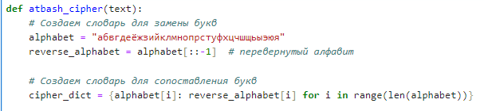

---
## Front matter
lang: ru-RU
title:  лабораторной работе №1
author: Алгайли Абдулазиз Мохаммед
institute: РУДН, Москва, Россия

date: 25 Сентября 2024

## Formatting
toc: false
slide_level: 2
theme: metropolis
header-includes: 
 - \metroset{progressbar=frametitle,sectionpage=progressbar,numbering=fraction}
 - '\makeatletter'
 - '\beamer@ignorenonframefalse'
 - '\makeatother'
aspectratio: 43
section-titles: true
---

| **Дисциплина** | **Лабораторная**| **ФИО** |
| ------ | ------ | ------- |
| Математические основы защиты информации и информационной безопасности|  №1 | Александра Миличевич |

# Цель работы

Познакомиться с шифрами Цезаря и Атбаш.

# Задание

1. Реализовать шифр Цезаря с произвольным ключом k.
2. Реализовать шифр Атбаш.

# Выполнение лабораторной работы

1) Этот код реализует шифр Цезаря для шифрования текста. Он сдвигает каждую букву на указанное число позиций в алфавите, сохраняя регистр (заглавные или строчные). Все остальные символы, такие как цифры или знаки препинания, остаются без изменений. Формула (ord(char) - ord('a') + shift) % 26 + ord('a') используется для преобразования букв: она вычисляет позицию буквы в алфавите, добавляет сдвиг, возвращает результат в диапазон от 0 до 25 (циклично) и преобразует обратно в символ.

{ width=70% }

2)Этот код запрашивает у пользователя текст и значение сдвига, затем вызывает функцию caesar_cipher для шифрования текста и выводит результат на экран.

{ width=70% }

3)В строке reverse_alphabet = alphabet[::-1] создается перевернутый алфавит, где буквы идут в обратном порядке. Затем с помощью генератора словаря cipher_dict для каждой буквы из оригинального алфавита создается пара, сопоставляющая её с буквой из перевернутого алфавита.
{ width=70% }
4)
Этот код перебирает каждый символ в строке text (приведенной к нижнему регистру). Если символ — буква, она заменяется по словарю cipher_dict; если нет (например, пробел или знак препинания), символ остается без изменений. Все измененные символы собираются в список result, который затем объединяется в строку и возвращается.
{ width=70% }
5)Код шифрует строку text с помощью функции atbash_cipher и выводит исходный и зашифрованный текст.
{ width=70% }
# Выводы

Реализрваны шифр Цезаря и  шифр Атбаш.
