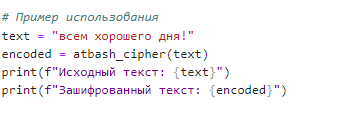

---
## Front matter
title: "Шаблон отчёта по лабораторной работе №1"
subtitle: "Дисциплина: Математические основы защиты информации и информационной безопасности"
author: "Миличевич Александра"

## Generic otions
lang: ru-RU
toc-title: "Содержание"

## Bibliography
bibliography: bib/cite.bib
csl: pandoc/csl/gost-r-7-0-5-2008-numeric.csl

## Pdf output format
toc: true # Table of contents
toc-depth: 2
lof: true # List of figures
lot: true # List of tables
fontsize: 12pt
linestretch: 1.5
papersize: a4
documentclass: scrreprt
## I18n polyglossia
polyglossia-lang:
  name: russian
  options:
	- spelling=modern
	- babelshorthands=true
polyglossia-otherlangs:
  name: english
## I18n babel
babel-lang: russian
babel-otherlangs: english
## Fonts
mainfont: IBM Plex Serif
romanfont: IBM Plex Serif
sansfont: IBM Plex Sans
monofont: IBM Plex Mono
mathfont: STIX Two Math
mainfontoptions: Ligatures=Common,Ligatures=TeX,Scale=0.94
romanfontoptions: Ligatures=Common,Ligatures=TeX,Scale=0.94
sansfontoptions: Ligatures=Common,Ligatures=TeX,Scale=MatchLowercase,Scale=0.94
monofontoptions: Scale=MatchLowercase,Scale=0.94,FakeStretch=0.9
mathfontoptions:
## Biblatex
biblatex: true
biblio-style: "gost-numeric"
biblatexoptions:
  - parentracker=true
  - backend=biber
  - hyperref=auto
  - language=auto
  - autolang=other*
  - citestyle=gost-numeric
## Pandoc-crossref LaTeX customization
figureTitle: "Рис."
tableTitle: "Таблица"
listingTitle: "Листинг"
lofTitle: "Список иллюстраций"
lotTitle: "Список таблиц"
lolTitle: "Листинги"
## Misc options
indent: true
header-includes:
  - \usepackage{indentfirst}
  - \usepackage{float} # keep figures where there are in the text
  - \floatplacement{figure}{H} # keep figures where there are in the text
---

# Цель работы

Познакомиться с шифрами Цезаря и Атбаш.

# Задание

1. Реализовать шифр Цезаря с произвольным ключом k.
2. Реализовать шифр Атбаш.

# Выполнение лабораторной работы

1) Этот код реализует шифр Цезаря для шифрования текста. Он сдвигает каждую букву на указанное число позиций в алфавите, сохраняя регистр (заглавные или строчные). Все остальные символы, такие как цифры или знаки препинания, остаются без изменений. Формула (ord(char) - ord('a') + shift) % 26 + ord('a') используется для преобразования букв: она вычисляет позицию буквы в алфавите, добавляет сдвиг, возвращает результат в диапазон от 0 до 25 (циклично) и преобразует обратно в символ.

{#fig:001 width=70%}

2)Этот код запрашивает у пользователя текст и значение сдвига, затем вызывает функцию caesar_cipher для шифрования текста и выводит результат на экран.

{#fig:002 width=70%}

3)В строке reverse_alphabet = alphabet[::-1] создается перевернутый алфавит, где буквы идут в обратном порядке. Затем с помощью генератора словаря cipher_dict для каждой буквы из оригинального алфавита создается пара, сопоставляющая её с буквой из перевернутого алфавита.
{#fig:003 width=70%}
4)
Этот код перебирает каждый символ в строке text (приведенной к нижнему регистру). Если символ — буква, она заменяется по словарю cipher_dict; если нет (например, пробел или знак препинания), символ остается без изменений. Все измененные символы собираются в список result, который затем объединяется в строку и возвращается.
{ width=70% }
5)Код шифрует строку text с помощью функции atbash_cipher и выводит исходный и зашифрованный текст.
{#fig:004 width=70%}
# Выводы

Реализрваны шифр Цезаря и  шифр Атбаш.
