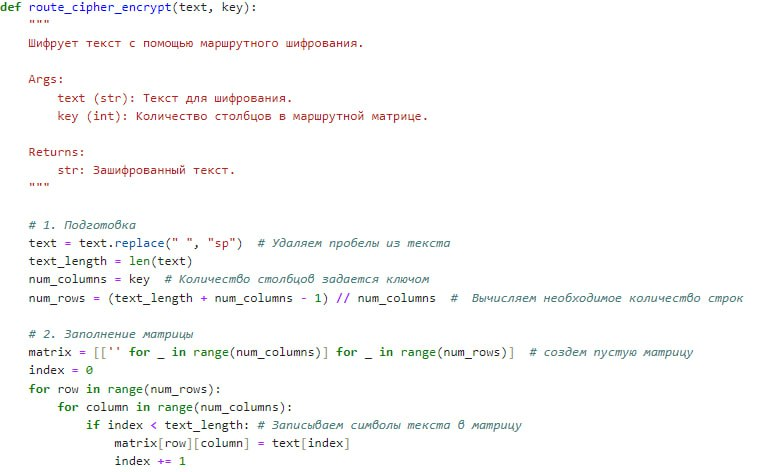
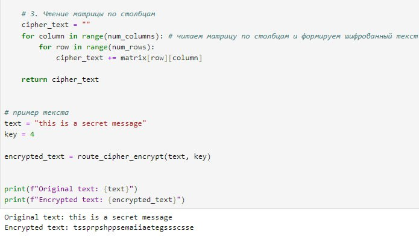
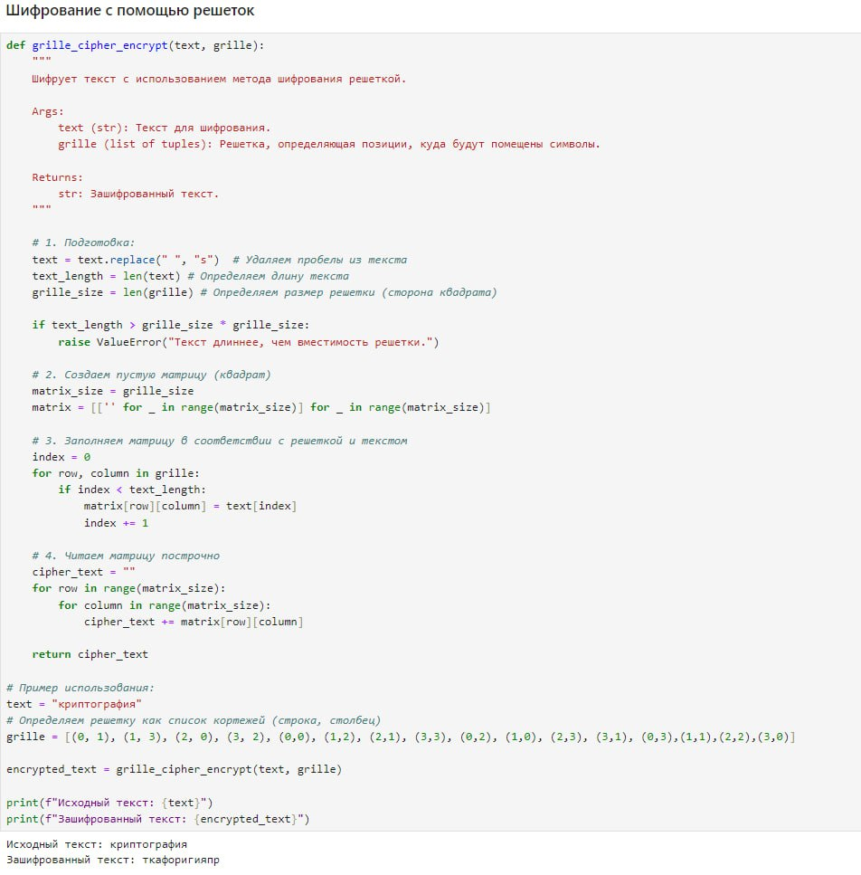
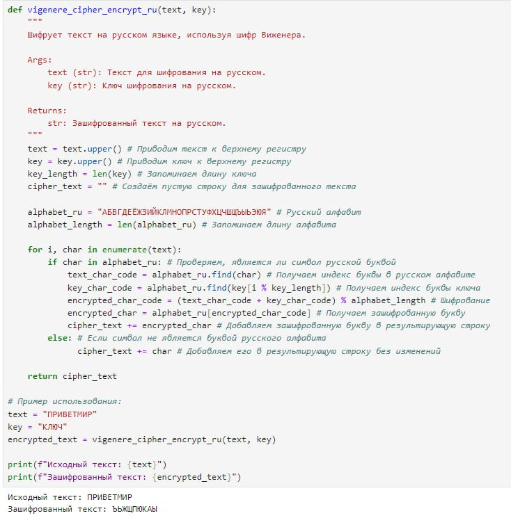

---
## Front matter
title: "Шаблон отчёта по лабораторной работе №2"
subtitle: "Дисциплина: Математические основы защиты информации и информационной безопасности"
author: "Миличевич Александра"

## Generic otions
lang: ru-RU
toc-title: "Содержание"

## Bibliography
bibliography: bib/cite.bib
csl: pandoc/csl/gost-r-7-0-5-2008-numeric.csl

## Pdf output format
toc: true # Table of contents
toc-depth: 2
lof: true # List of figures
lot: true # List of tables
fontsize: 12pt
linestretch: 1.5
papersize: a4
documentclass: scrreprt
## I18n polyglossia
polyglossia-lang:
  name: russian
  options:
	- spelling=modern
	- babelshorthands=true
polyglossia-otherlangs:
  name: english
## I18n babel
babel-lang: russian
babel-otherlangs: english
## Fonts
mainfont: IBM Plex Serif
romanfont: IBM Plex Serif
sansfont: IBM Plex Sans
monofont: IBM Plex Mono
mathfont: STIX Two Math
mainfontoptions: Ligatures=Common,Ligatures=TeX,Scale=0.94
romanfontoptions: Ligatures=Common,Ligatures=TeX,Scale=0.94
sansfontoptions: Ligatures=Common,Ligatures=TeX,Scale=MatchLowercase,Scale=0.94
monofontoptions: Scale=MatchLowercase,Scale=0.94,FakeStretch=0.9
mathfontoptions:
## Biblatex
biblatex: true
biblio-style: "gost-numeric"
biblatexoptions:
  - parentracker=true
  - backend=biber
  - hyperref=auto
  - language=auto
  - autolang=other*
  - citestyle=gost-numeric
## Pandoc-crossref LaTeX customization
figureTitle: "Рис."
tableTitle: "Таблица"
listingTitle: "Листинг"
lofTitle: "Список иллюстраций"
lotTitle: "Список таблиц"
lolTitle: "Листинги"
## Misc options
indent: true
header-includes:
  - \usepackage{indentfirst}
  - \usepackage{float} # keep figures where there are in the text
  - \floatplacement{figure}{H} # keep figures where there are in the text
---

# Цель работы

Познакомиться с шифрами перестановки.

# Задание

1. Программно реализовать маршрутное шифрование.
2. Программно реализовать шифрование с помощью решёток.
3. Программно реализовать шифр Виженера.

# Выполнение лабораторной работы
### Маршрутное шифроваие

1) Код сначала подготавливает текст для шифрования, заменяя пробелы на “sp” и определяя размеры матрицы на основе длины текста и заданного ключа. Затем, символы текста последовательно записываются в матрицу по строкам, заполняя её слева направо и сверху вниз. Эта матрица используется для маршрутного шифрования.

{#fig:001 width=70%}

1.1     # 3. Чтение матрицы по столбцам
    cipher_text = "" После заполнения матрицы, код считывает ее по столбцам сверху вниз, формируя зашифрованный текст. Символы каждого столбца добавляются в общий шифрованный текст, который затем возвращается как результат работы алгоритма. Таким образом текст шифруется путем записи по строкам и чтения по столбцам.
{#fig:002 width=70%}

### Шифрование с помощью решеток
Этот код реализует шифрование с использованием решетки (grill  e cipher). Сначала он подготавливает текст, удаляя пробелы и проверяя, что текст не превышает размер решетки. Затем, он создает матрицу (решетку) нужного размера, заполняет ее символами текста в порядке, заданном списком grille, и, наконец, считывает матрицу построчно, формируя зашифрованный текст.

В примере, решетка (grille) задается списком кортежей, где каждый кортеж указывает строку и столбец, куда должен быть помещен соответствующий символ текста. Результат работы алгоритма — зашифрованный текст, сформированный из прочитанных по строкам элементов матрицы.
{#fig:003 width=70%}

### Таблица Виженера 
Этот код реализует шифрование Виженера, где каждый символ текста сдвигается на величину, определяемую соответствующим символом ключа, повторяющегося по циклу. Функция vigenere_cipher_encrypt сначала приводит текст и ключ к верхнему регистру, а затем для каждой буквы текста вычисляет её сдвиг, используя соответствующую букву ключа и выполняя операцию взятия остатка от деления на 26. Результатом является шифрованный текст, где неалфавитные символы остаются неизменными.В этом конкретном примере текст “HELLO” шифруется с помощью ключа “KEY”, что приводит к зашифрованному тексту, где буквы сдвигаются на величину, задаваемую буквами ключа. Разница между шифрованием Виженера и другими шифрами, например, маршрутным или решеточным, заключается в том, что Виженер использует полиалфавитный шифр с циклическим ключом, в то время как маршрутный и решеточный шифры используют перестановку символов.

{#fig:004 width=70%}

В коде для шифрования Виженера на русском языке, добавлен русский алфавит (alphabet_ru) и его длина (alphabet_length), чтобы обрабатывать символы русского языка. Индексы букв берутся из русского алфавита alphabet_ru.find(), и для шифрования используется модуль от деления на длину русского алфавита. Если символ не найден в русском алфавите, он добавляется в зашифрованный текст без изменений.
{#fig:005 width=70%}

# Выводы

Программно реализованы шифры перестановки.
