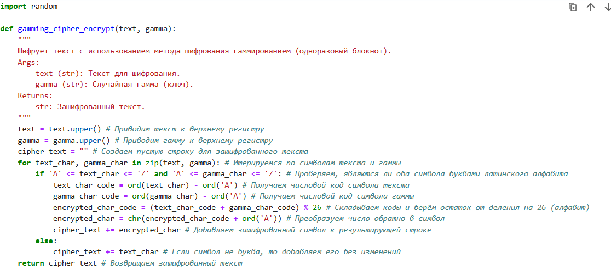
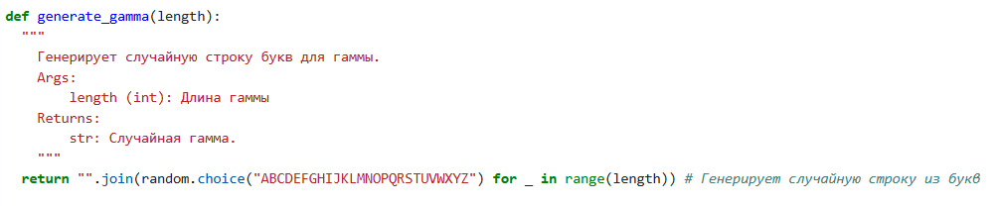
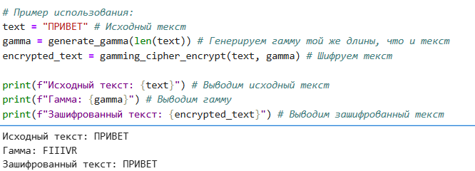

---
## Front matter
lang: ru-RU
title:  Лабораторная работа №3
subtitle: Презентация
author:
  -  Миличевич Александра
institute:
  - Российский университет дружбы народов, Москва, Россия
  
date: 15 февраля 2025

## i18n babel
babel-lang: russian
babel-otherlangs: english

## Formatting pdf
toc: false
toc-title: Содержание
slide_level: 2
aspectratio: 169
section-titles: true
theme: metropolis
header-includes:
 - \metroset{progressbar=frametitle,sectionpage=progressbar,numbering=fraction}
 - '\makeatletter'
 - '\beamer@ignorenonframefalse'
 - '\makeatother'
---

# Цель работы
Познакомится с способом шифрования гаммирование

# Задание

1. Реализовать алгоритм шифрования гаммированием конечной гаммой.

---

Гаммирование — это метод шифрования, который использует псевдослучайную последовательность битов, называемую гаммой, для преобразования открытого текста в зашифрованный. Этот метод обеспечивает высокую степень безопасности, так как каждая битовая
 позиция открытого текста изменяется в зависимости от соответствующего бита гаммы. 
 Гаммирование часто применяется в криптографии для защиты данных, так как оно позволяет эффективно скрывать информацию от несанкционированного доступа.
 
 ---
 
 Гаммирование находит широкое применение в современных системах шифрования, таких как протоколы передачи данных и защищенные коммуникации, обеспечивая высокий уровень конфиденциальности и защиты информации от несанкционированного доступа.
 
 
 ---
 
 #  Выполнение лабораторной работы
 
##  Шифрование гаммированием (одноразовый блокнот) на русском языке

Этот код реализует шифрование гаммированием для русского языка, также известное как шифрование с использованием одноразового блокнота.

### Функция `gamming_cipher_encrypt_ru(text, gamma)`

Эта функция выполняет шифрование текста с помощью гаммирования.

*   **Вход:**
    *   `text`: Строка - текст для шифрования (русский язык).
    *   `gamma`: Строка - гамма (ключ) для шифрования (русский язык).
*   **Выход:** Строка - зашифрованный текст (русский язык).

---

{ width=70% }

---

#### Логика работы:

1.  Приводит текст и гамму к верхнему регистру.
2.  Создает пустую строку для хранения зашифрованного текста.
3.  Определяет русский алфавит и его длину.
4.  Перебирает символы текста и гаммы параллельно.
5.  Для русских букв:
    *   Вычисляет индексы букв в алфавите.
    *   Складывает индексы, берет остаток от деления на длину алфавита для получения индекса зашифрованного символа.
    *   Добавляет зашифрованный символ в результирующую строку.
6.  Для остальных символов:
    *   Добавляет их в результирующую строку без изменений.

	
	
---

### Функция `generate_gamma_ru(length)`

Эта функция генерирует случайную гамму заданной длины.

*   **Вход:** `length`: Целое число - длина гаммы.
*   **Выход:** Строка - случайная гамма (русский язык).

---

{ width=70% }

---

### Пример использования

1.  Задается исходный текст: ПРИВЕТ.
2.  Генерируется случайная гамма той же длины.
3.  Выполняется шифрование текста с использованием гаммы.
4.  Выводится исходный текст, гамма и зашифрованный текст.

---

{ width=70% }

---

### Важные замечания

*   Для максимальной безопасности, гамма должна быть действительно случайной и использоваться только один раз для каждого сообщения.
*   Этот код предназначен только для текста на русском языке.
*   Шифрование гаммированием является одним из самых надежных методов шифрования при условии правильного использования.

---

# Выводы

Программно реализовано шифрование гаммированием.

