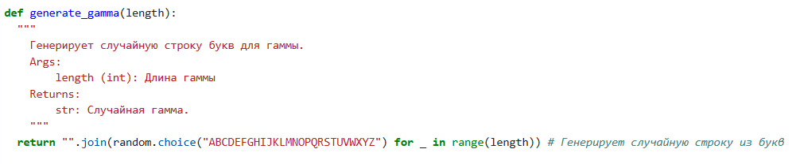
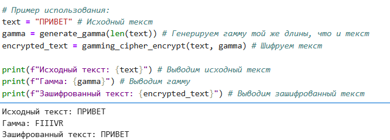

---
# Front matter
lang: ru-RU
title: "Лабораторная работа №3"
subtitle: "Дисциплина: Математические основы защиты информации и информационной безопасности"
author: "Миличевич Александра"

# Formatting
toc-title: "Содержание"
toc: true # Table of contents
toc_depth: 2
lof: true # Список рисунков
lot: true # Список таблиц
fontsize: 12pt
linestretch: 1.5
papersize: a4paper
documentclass[english,russian]{babel}
polyglossia-lang: russian
polyglossia-otherlangs: english
mainfont: Liberation Serif
romanfont: Liberation Serif
sansfont: Liberation Sans
monofont: Liberation Mono
mainfontoptions: Ligatures=TeX
romanfontoptions: Ligatures=TeX
sansfontoptions: Ligatures=TeX,Scale=MatchLowercase
monofontoptions: Scale=MatchLowercase
indent: true
pdf-engine: pdflatex
header-includes:
  - \usepackage[utf8]{inputenc}
  - \usepackage[russian]{babel}
  - \linepenalty=10 # the penalty added to the badness of each line within a paragraph (no associated penalty node) Increasing the value makes tex try to have fewer lines in the paragraph.
  - \interlinepenalty=0 # value of the penalty (node) added after each line of a paragraph.
  - \hyphenpenalty=50 # the penalty for line breaking at an automatically inserted hyphen
  - \exhyphenpenalty=50 # the penalty for line breaking at an explicit hyphen
  - \binoppenalty=700 # the penalty for breaking a line at a binary operator
  - \relpenalty=500 # the penalty for breaking a line at a relation
  - \clubpenalty=150 # extra penalty for breaking after first line of a paragraph
  - \widowpenalty=150 # extra penalty for breaking before last line of a paragraph
  - \displaywidowpenalty=50 # extra penalty for breaking before last line before a display math
  - \brokenpenalty=100 # extra penalty for page breaking after a hyphenated line
  - \predisplaypenalty=10000 # penalty for breaking before a display
  - \postdisplaypenalty=0 # penalty for breaking after a display
  - \floatingpenalty = 20000 # penalty for splitting an insertion (can only be split footnote in standard LaTeX)
  - \raggedbottom # or \flushbottom
  - \usepackage{float} # keep figures where there are in the text
  - \floatplacement{figure}{H} # keep figures where there are in the text 
---

| **Дисциплина** | **Лабораторная**| **ФИО** |
| ------ | ------ | ------- |
| Математические основы защиты информации и информационной безопасности|  №3 | Александра Миличевич |

# Цель работы
Познакомится с способом шифрования гаммирование

# Задание

1. Реализовать алгоритм шифрования гаммированием конечной гаммой

# Выполнение лабораторной работы
## Шифрование гаммированием (одноразовый блокнот) на русском языке

Этот код реализует шифрование гаммированием для русского языка, также известное как шифрование с использованием одноразового блокнота.

### Функция `gamming_cipher_encrypt_ru(text, gamma)`

Эта функция выполняет шифрование текста с помощью гаммирования.

*   **Вход:**
    *   `text`: Строка - текст для шифрования (русский язык).
    *   `gamma`: Строка - гамма (ключ) для шифрования (русский язык).
*   **Выход:** Строка - зашифрованный текст (русский язык).

{ width=70% }

#### Логика работы:

1.  Приводит текст и гамму к верхнему регистру.
2.  Создает пустую строку для хранения зашифрованного текста.
3.  Определяет русский алфавит и его длину.
4.  Перебирает символы текста и гаммы параллельно.
5.  Для русских букв:
    *   Вычисляет индексы букв в алфавите.
    *   Складывает индексы, берет остаток от деления на длину алфавита для получения индекса зашифрованного символа.
    *   Добавляет зашифрованный символ в результирующую строку.
6.  Для остальных символов:
    *   Добавляет их в результирующую строку без изменений.

### Функция `generate_gamma_ru(length)`

Эта функция генерирует случайную гамму заданной длины.

*   **Вход:** `length`: Целое число - длина гаммы.
*   **Выход:** Строка - случайная гамма (русский язык).

{ width=70% }

#### Логика работы:

1.  Определяет русский алфавит.
2.  Генерирует случайную строку заданной длины из символов русского алфавита.
{ width=70% }

### Пример использования

1.  Задается исходный текст: ПРИВЕТ.
2.  Генерируется случайная гамма той же длины.
3.  Выполняется шифрование текста с использованием гаммы.
4.  Выводится исходный текст, гамма и зашифрованный текст.

### Важные замечания

*   Для максимальной безопасности, гамма должна быть действительно случайной и использоваться только один раз для каждого сообщения.
*   Этот код предназначен только для текста на русском языке.
*   Шифрование гаммированием является одним из самых надежных методов шифрования при условии правильного использования.

# Выводы

Программно реализовано шифрование гаммированием.
