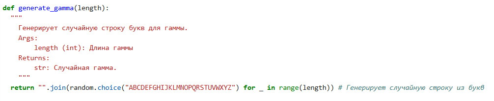

---
## Front matter
title: "Шаблон отчёта по лабораторной работе №3"
subtitle: "Дисциплина: Математические основы защиты информации и информационной безопасности"
author: "Миличевич Александра"

## Generic otions
lang: ru-RU
toc-title: "Содержание"

## Bibliography
bibliography: bib/cite.bib
csl: pandoc/csl/gost-r-7-0-5-2008-numeric.csl

## Pdf output format
toc: true # Table of contents
toc-depth: 2
lof: true # List of figures
lot: true # List of tables
fontsize: 12pt
linestretch: 1.5
papersize: a4
documentclass: scrreprt
## I18n polyglossia
polyglossia-lang:
  name: russian
  options:
	- spelling=modern
	- babelshorthands=true
polyglossia-otherlangs:
  name: english
## I18n babel
babel-lang: russian
babel-otherlangs: english
## Fonts
mainfont: IBM Plex Serif
romanfont: IBM Plex Serif
sansfont: IBM Plex Sans
monofont: IBM Plex Mono
mathfont: STIX Two Math
mainfontoptions: Ligatures=Common,Ligatures=TeX,Scale=0.94
romanfontoptions: Ligatures=Common,Ligatures=TeX,Scale=0.94
sansfontoptions: Ligatures=Common,Ligatures=TeX,Scale=MatchLowercase,Scale=0.94
monofontoptions: Scale=MatchLowercase,Scale=0.94,FakeStretch=0.9
mathfontoptions:
## Biblatex
biblatex: true
biblio-style: "gost-numeric"
biblatexoptions:
  - parentracker=true
  - backend=biber
  - hyperref=auto
  - language=auto
  - autolang=other*
  - citestyle=gost-numeric
## Pandoc-crossref LaTeX customization
figureTitle: "Рис."
tableTitle: "Таблица"
listingTitle: "Листинг"
lofTitle: "Список иллюстраций"
lotTitle: "Список таблиц"
lolTitle: "Листинги"
## Misc options
indent: true
header-includes:
  - \usepackage{indentfirst}
  - \usepackage{float} # keep figures where there are in the text
  - \floatplacement{figure}{H} # keep figures where there are in the text
---

# Цель работы
Познакомится с способом шифрования гаммирование

# Задание

1. Реализовать алгоритм шифрования гаммированием конечной гаммой

# Выполнение лабораторной работы

## Шифрование гаммированием (одноразовый блокнот) на русском языке

Этот код реализует шифрование гаммированием для русского языка, также известное как шифрование с использованием одноразового блокнота.

### Функция `gamming_cipher_encrypt_ru(text, gamma)`

Эта функция выполняет шифрование текста с помощью гаммирования.

*   **Вход:**
    *   `text`: Строка - текст для шифрования (русский язык).
    *   `gamma`: Строка - гамма (ключ) для шифрования (русский язык).
*   **Выход:** Строка - зашифрованный текст (русский язык).

{#fig:001 width=70%}

#### Логика работы:

1.  Приводит текст и гамму к верхнему регистру.
2.  Создает пустую строку для хранения зашифрованного текста.
3.  Определяет русский алфавит и его длину.
4.  Перебирает символы текста и гаммы параллельно.
5.  Для русских букв:
    *   Вычисляет индексы букв в алфавите.
    *   Складывает индексы, берет остаток от деления на длину алфавита для получения индекса зашифрованного символа.
    *   Добавляет зашифрованный символ в результирующую строку.
6.  Для остальных символов:
    *   Добавляет их в результирующую строку без изменений.

### Функция `generate_gamma_ru(length)`

Эта функция генерирует случайную гамму заданной длины.

*   **Вход:** `length`: Целое число - длина гаммы.
*   **Выход:** Строка - случайная гамма (русский язык).

{#fig:002 width=70%}

#### Логика работы:

1.  Определяет русский алфавит.
2.  Генерирует случайную строку заданной длины из символов русского алфавита.

{#fig:003 width=70%}

### Пример использования

1.  Задается исходный текст: ПРИВЕТ.
2.  Генерируется случайная гамма той же длины.
3.  Выполняется шифрование текста с использованием гаммы.
4.  Выводится исходный текст, гамма и зашифрованный текст.

### Важные замечания

*   Для максимальной безопасности, гамма должна быть действительно случайной и использоваться только один раз для каждого сообщения.
*   Этот код предназначен только для текста на русском языке.
*   Шифрование гаммированием является одним из самых надежных методов шифрования при условии правильного использования.

# Выводы

Программно реализовано шифрование гаммированием.
