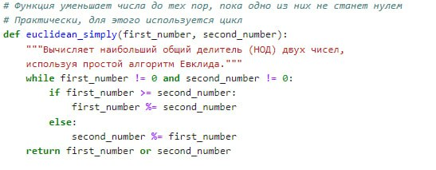
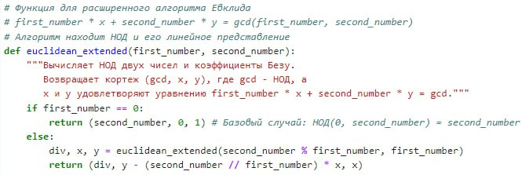
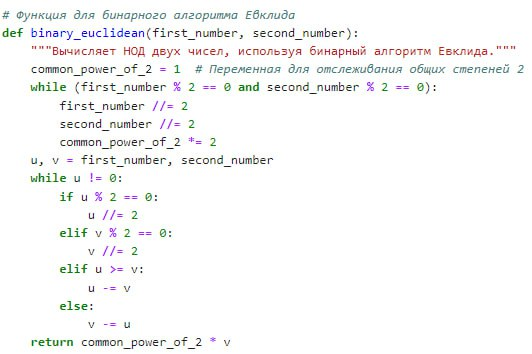

---
## Front matter
lang: ru-RU
title:  лабораторной работе №1
author: Алгайли Абдулазиз Мохаммед
institute: РУДН, Москва, Россия

date: 25 Сентября 2024

## Formatting
toc: false
slide_level: 2
theme: metropolis
header-includes: 
 - \metroset{progressbar=frametitle,sectionpage=progressbar,numbering=fraction}
 - '\makeatletter'
 - '\beamer@ignorenonframefalse'
 - '\makeatother'
aspectratio: 43
section-titles: true
---

| **Дисциплина** | **Лабораторная**| **ФИО** |
| ------ | ------ | ------- |
| Математические основы защиты информации и информационной безопасности|  №4 | Александра Миличевич |

# Цель работы

Познакомиться с алгоритмами вычисления наибольшего общего делителя (Алгоритмами Евклида).

# Задание

1.Реализовать следующие алгоритмы программно

1.1 Алгоритм Евклида
1.2 Расширенный алгоритм Евклида
1.3 Бинарный алгоритм Евклида
1.4 Расширенный бинарный алгоритм Евклида

# Выполнение лабораторной работы
## Объяснение алгоритмов Евклида для нахождения НОД

Этот документ описывает три функции, реализующие различные алгоритмы Евклида для вычисления наибольшего общего делителя (НОД) двух чисел.

### 1. `euclidean_simply(first_number, second_number)`

Эта функция реализует базовый итеративный алгоритм Евклида.

#### Как работает:
1.  Функция использует цикл `while`, который выполняется до тех пор, пока оба числа (`first_number` и `second_number`) не станут равны нулю.
2.  Внутри цикла, если `first_number` больше или равно `second_number`, то `first_number` заменяется на остаток от деления `first_number` на `second_number` (`first_number %= second_number`).
3.  Иначе, `second_number` заменяется на остаток от деления `second_number` на `first_number` (`second_number %= first_number`).
4.  Когда один из чисел становится равным нулю, функция возвращает второе число (которое и есть НОД).
Эта функция реализует расширенный алгоритм Евклида.
{ width=70% }

### 2. `euclidean_extended(first_number, second_number)`

#### Как работает:
1.  Функция использует рекурсию.
2.  Базовый случай: если `first_number` равно 0, то возвращается кортеж `(second_number, 0, 1).
3.  В противном случае, функция вызывает себя рекурсивно с параметрами `second_number % first_number` и `first_number`, получает результаты `div, x, y`.
4.  Затем вычисляет и возвращает новый кортеж `(div, y - (second_number // first_number) * x, x)`. Этот кортеж содержит НОД и коэффициенты Безу.
{ width=70% }

### 3. `binary_euclidean(first_number, second_number)`

#### Как работает:

1.  Используется переменная `common_power_of_2` для отслеживания общих степеней двойки.
2.  Сначала числа делятся на 2, пока оба четные, при этом `common_power_of_2` умножается на 2.
3.  Далее, используются `u` и `v` для хранения текущих значений.
4.  Пока `u` не равно нулю, выполняется цикл:
    *   Если `u` четное, то `u` делится на 2.
    *   Иначе, если `v` четное, то `v` делится на 2.
    *   Иначе, если `u` больше или равно `v`, то `u` вычитается `v`.
    *   Иначе, `v` вычитается `u`.
5.  Функция возвращает результат, умноженный на накопленную степень двойки.

{ width=70% }

### 4. `binary_euclidean_extended(first_number, second_number)`

Эта функция реализует расширенный бинарный алгоритм Евклида.

#### Как работает:

1.  Так же как и в 'binary_euclidean', выделяется общая степень двойки.
2.  Используются 'u' и 'v' для хранения текущих значений. 'A, B, C, D' — это коэффициенты для расширенного алгоритма.
3.  Пока 'u' не равно нулю, выполняется цикл:
    *   Если 'u' четное, то 'u' делится на 2. Если 'A' и 'B' четные, то они тоже делятся на 2. Иначе, 'A' и 'B' обновляются с учетом четности и делителя.
    *   Аналогично для 'v' и 'C, D'.
    *   Если 'u >= v', то `u` и 'A, B' уменьшаются.
    *   Иначе, 'v' и 'C, D' уменьшаются.
4.  Функция возвращает НОД и коэффициенты Безу, умноженные на общую степень двойки.
### Заключение

{ width=70% }

Эти функции предоставляют три разных способа для вычисления наибольшего общего делителя (НОД). `euclidean_simply` — это простой итеративный подход, `euclidean_extended` — это рекурсивный метод, который также находит коэффициенты Безу, а `binary_euclidean` использует битовые операции для повышения эффективности
