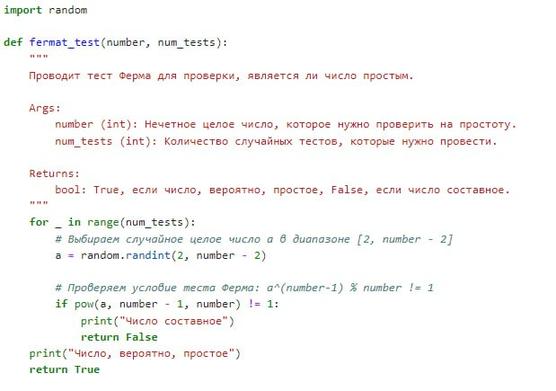
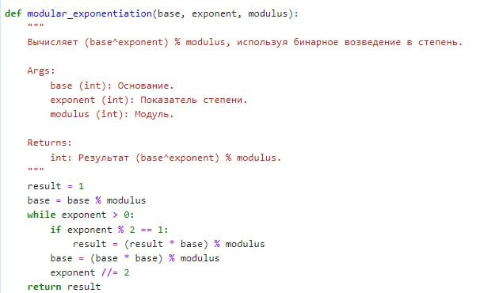
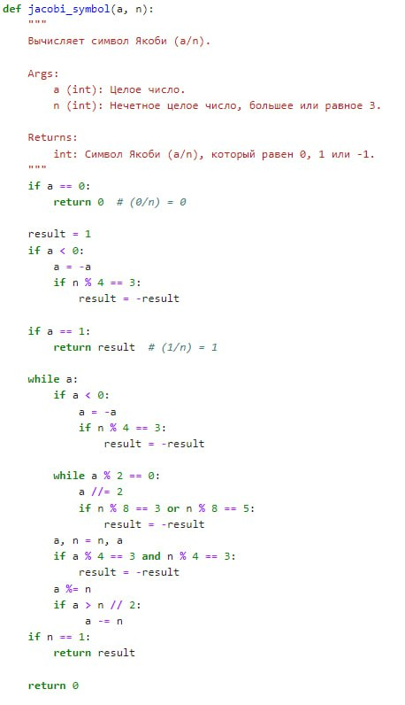
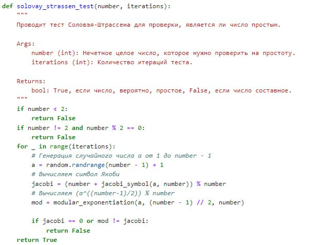
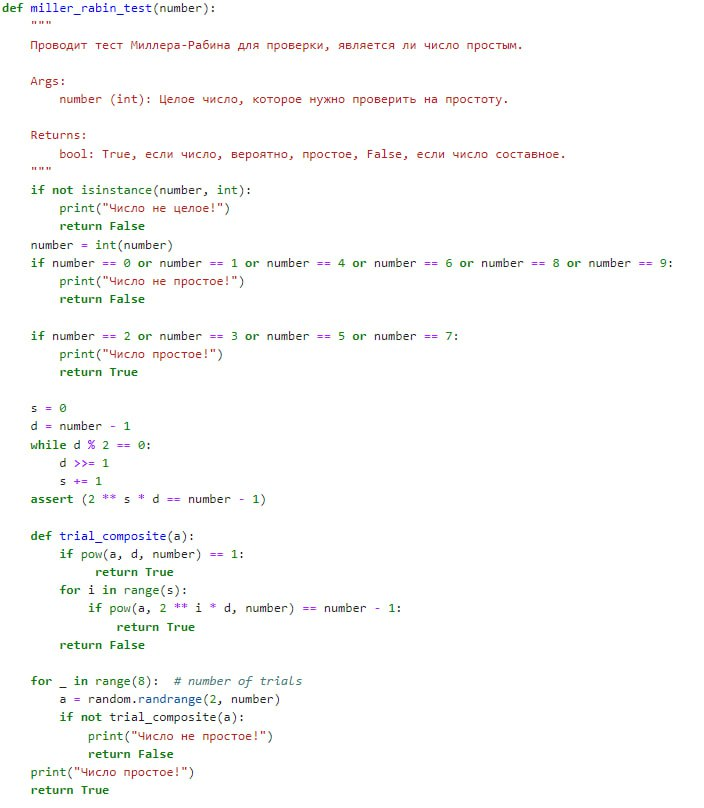

---
## Front matter
title: "Шаблон отчёта по лабораторной работе №5"
subtitle: "Дисциплина: Математические основы защиты информации и информационной безопасности"
author: "Миличевич Александра"

## Generic otions
lang: ru-RU
toc-title: "Содержание"

## Bibliography
bibliography: bib/cite.bib
csl: pandoc/csl/gost-r-7-0-5-2008-numeric.csl

## Pdf output format
toc: true # Table of contents
toc-depth: 2
lof: true # List of figures
lot: true # List of tables
fontsize: 12pt
linestretch: 1.5
papersize: a4
documentclass: scrreprt
## I18n polyglossia
polyglossia-lang:
  name: russian
  options:
	- spelling=modern
	- babelshorthands=true
polyglossia-otherlangs:
  name: english
## I18n babel
babel-lang: russian
babel-otherlangs: english
## Fonts
mainfont: IBM Plex Serif
romanfont: IBM Plex Serif
sansfont: IBM Plex Sans
monofont: IBM Plex Mono
mathfont: STIX Two Math
mainfontoptions: Ligatures=Common,Ligatures=TeX,Scale=0.94
romanfontoptions: Ligatures=Common,Ligatures=TeX,Scale=0.94
sansfontoptions: Ligatures=Common,Ligatures=TeX,Scale=MatchLowercase,Scale=0.94
monofontoptions: Scale=MatchLowercase,Scale=0.94,FakeStretch=0.9
mathfontoptions:
## Biblatex
biblatex: true
biblio-style: "gost-numeric"
biblatexoptions:
  - parentracker=true
  - backend=biber
  - hyperref=auto
  - language=auto
  - autolang=other*
  - citestyle=gost-numeric
## Pandoc-crossref LaTeX customization
figureTitle: "Рис."
tableTitle: "Таблица"
listingTitle: "Листинг"
lofTitle: "Список иллюстраций"
lotTitle: "Список таблиц"
lolTitle: "Листинги"
## Misc options
indent: true
header-includes:
  - \usepackage{indentfirst}
  - \usepackage{float} # keep figures where there are in the text
  - \floatplacement{figure}{H} # keep figures where there are in the text
---

## Цель лабораторной 

Цель лабораторной работы №5 заключается в ознакомлении студентов с алгоритмами проверки простоты чисел, такими как тест Ферма, тест Соловэя-Штрассена и тест Миллера-Рабина, а также с методами вычисления символа Якоби и модульного возведения в степень. Студенты должны научиться реализовывать эти алгоритмы на практике, понять их математические основы и оценить их эффективность в контексте криптографических приложений.

## Тест Ферма и модульное возведение в степень

Этот документ описывает две функции: тест Ферма для проверки простоты числа и функцию модульного возведения в степень.

### 1. `fermat_test(number, num_tests)`

Эта функция реализует тест Ферма для проверки, является ли данное число, вероятно, простым.

#### Как работает:

1.  Функция принимает на вход два аргумента:
    *   `number`: Нечетное целое число, которое нужно проверить на простоту.
    *   `num_tests`: Количество случайных проверок, которые нужно провести.
2.  В цикле `for` функция выполняет `num_tests` проверок.
3.  В каждой проверке выбирается случайное целое число `a` в диапазоне от 2 до `number - 2`.
4.  Вычисляется `a^(number - 1) % number` с использованием встроенной функции `pow(a, number - 1, number)`, которая реализует быстрое модульное возведение в степень.
5.  Если `a^(number - 1) % number` не равно 1, то это означает, что число `number` составное. Функция выводит сообщение "Число составное" и возвращает `False`.
6.  Если все проверки пройдены, то это говорит о том, что число, вероятно, простое. Функция выводит сообщение "Число, вероятно, простое" и возвращает `True`.

{#fig:001 width=70%}

#### Важные замечания:

*   Тест Ферма — это вероятностный тест. Если тест проходит, то число, скорее всего, простое, но есть небольшая вероятность, что число окажется составным, хотя и проходит тест Ферма (так называемые числа Кармайкла).
*   Чем больше количество тестов, тем выше вероятность правильного результата.

### 2. `modular_exponentiation(base, exponent, modulus)`

Эта функция реализует алгоритм бинарного возведения в степень по модулю.

#### Как работает:

1.  Функция принимает три аргумента:
    *   `base`: Основание.
    *   `exponent`: Показатель степени.
    *   `modulus`: Модуль.
2.  Инициализирует переменную `result` значением 1.
3.  Берет остаток от деления `base` на `modulus`, чтобы уменьшить размер основания.
4.  Использует цикл `while`, который продолжается, пока `exponent` больше 0.
5.  Внутри цикла:
    *   Если `exponent` нечетный, то `result` умножается на `base` и берется остаток от деления на `modulus` (`result = (result * base) % modulus`).
    *   `base` возводится в квадрат и берется остаток от деления на `modulus` (`base = (base * base) % modulus`).
    *   `exponent` делится на 2 (`exponent //= 2`).
6.  Функция возвращает значение `result`, которое равно `(base^exponent) % modulus`.

{#fig:002 width=70%}

#### Важные замечания:

*   Бинарное возведение в степень — это эффективный способ вычисления больших степеней по модулю.
*   Этот алгоритм позволяет избежать переполнения переменных при вычислении больших чисел.

# Вычисление символа Якоби

Этот документ описывает функцию для вычисления символа Якоби (a/n). Символ Якоби является обобщением символа Лежандра и используется в теории чисел, в частности, в тестах простоты.

### Функция `jacobi_symbol(a, n)`

Эта функция вычисляет символ Якоби (a/n).

#### Описание:

*   **Вход:**
    *   `a` (int): Целое число.
    *   `n` (int): Нечетное целое число, большее или равное 3.

*   **Выход:**
    *   Символ Якоби (a/n), который равен 0, 1 или -1.

#### Как работает:

1.  **Базовый случай:** Если `a` равно 0, возвращается 0, так как (0/n) = 0.
2.  **Инициализация:** Устанавливается начальное значение результата `result` равным 1.
3.  **Отрицательное a:** Если `a` отрицательное, то `a` заменяется на `-a`, а если `n` по модулю 4 дает остаток 3, то результат меняет знак.
4.  **a равно 1:** Если `a` равно 1, то результат возвращается (так как (1/n) = 1).
5.  **Основной цикл:** Выполняется цикл `while a`, который продолжает работу, пока `a` не станет равным 0.
6.  **Отрицательное a (внутри цикла):** Если `a` отрицательное, то `a` заменяется на `-a`, а если `n` по модулю 4 дает остаток 3, то результат меняет знак.
7.  **Четное a:**  Пока `a` четное, `a` делится на 2. Если `n` по модулю 8 дает остаток 3 или 5, то результат меняет знак.
8.  **Замена значений:** Значения `a` и `n` меняются местами (`a, n = n, a`).
9.  **Квадратичный закон взаимности:** Если `a` и `n` по модулю 4 дают остаток 3, то результат меняет знак.
10. **Уменьшение a:** `a` берется по модулю `n`, а если `a` больше, чем половина `n`, то `a` вычитается из `n`.
11. **Финальное условие:** Если `n` равен 1, то функция возвращает `result`.
12. **В остальных случаях:** Функция возвращает 0.

#### Важные замечания:

*   Символ Якоби (a/n) равен 0, если `a` и `n` не взаимно простые, равен 1, если `a` является квадратичным вычетом по модулю `n`, и равен -1, если `a` не является квадратичным вычетом по модулю `n`.
*   Эта функция использует свойства символа Якоби, такие как закон квадратичной взаимности, чтобы эффективно вычислить символ.
*   Символ Якоби используется для теста Соловэя — Штрассена и других тестов простоты.

### Заключение

Этот документ описывает функцию `jacobi_symbol(a, n)`, которая вычисляет символ Якоби (a/n) для заданных целых чисел `a` и `n`. Эта функция использует ряд математических свойств, чтобы эффективно вычислить символ Якоби, и важна в теории чисел и криптографии.
{#fig:003 width=70%}

## Тест Соловэя-Штрассена для проверки простоты

Этот документ описывает функцию `solovay_strassen_test`, реализующую тест Соловэя-Штрассена для проверки простоты числа.

### Функция `solovay_strassen_test(number, iterations)`

Эта функция проверяет, является ли заданное нечетное число, вероятно, простым, используя тест Соловэя-Штрассена.

#### Описание:

*   **Вход:**
    *   `number` (int): Нечетное целое число для проверки.
    *   `iterations` (int): Количество итераций теста.

*   **Выход:**
    *   `True`, если число, вероятно, простое.
    *   `False`, если число составное.

#### Как работает:

1.  **Проверка на 2 и меньше:** Если число меньше 2 или четное (кроме 2), то возвращается `False`.
2.  **Цикл итераций:** Выполняется `iterations` раз.
3.  **Генерация случайного числа:** Генерируется случайное число `a` от 1 до `number - 1`.
4.  **Вычисление символа Якоби:** Вычисляется символ Якоби `jacobi_symbol(a, number)`.
5.  **Вычисление модульного возведения в степень:** Вычисляется `a^((number-1)/2) % number` с помощью функции `modular_exponentiation`.
6.  **Проверка условий:** Если символ Якоби равен 0, или результат модульного возведения в степень не равен символу Якоби, то число составное, и возвращается `False`.
7.  **Вероятно простое:** Если все итерации пройдены без возврата `False`, то число, вероятно, простое и возвращается `True`.

#### Важные замечания:

*   Тест Соловэя-Штрассена является вероятностным.
*   Этот тест, как и тест Ферма, может ошибаться с небольшой вероятностью.
*   Чем больше итераций, тем выше вероятность корректного определения простоты.

### Заключение

Функция `solovay_strassen_test` предоставляет способ проверить, является ли нечетное число, вероятно, простым. Она использует случайные числа, символ Якоби и модульное возведение в степень для проведения теста
{#fig:004 width=70%}

## Тесты простоты чисел: Миллера-Рабина и другие

Этот документ описывает несколько функций для проверки, является ли число простым, включая тест Миллера-Рабина, тест Ферма и тест Соловэя-Штрассена, а также функции для вычисления символа Якоби и модульного возведения в степень.

### 1. `miller_rabin_test(number)`

Эта функция реализует тест Миллера-Рабина для проверки простоты числа.

#### Описание:

*   **Вход:**
    *   `number` (int): Целое число для проверки на простоту.

*   **Выход:**
    *   `True`, если число, вероятно, простое.
    *   `False`, если число составное.

#### Как работает:

1.  **Проверка типа:** Проверяется, является ли число целым. Если нет, выводится сообщение об ошибке и возвращается `False`.
2.  **Проверка на простые и составные:** Исключаются известные составные и простые числа (0, 1, 4, 6, 8, 9 и 2, 3, 5, 7).
3.  **Разложение `number - 1`:** Число `number - 1` представляется в виде `2^s * d`, где `d` нечетное. Вычисляются значения `s` и `d`.
4.  **Функция `trial_composite(a)`:** Вложенная функция проверяет, является ли число `a` свидетелем составности.
    *   Проверяет условие `a^d % number == 1`.
    *   Проверяет условие `a^(2^i * d) % number == number - 1` для `i` от 0 до `s-1`.
    *   Возвращает `True`, если хотя бы одно условие выполнилось, и `False` в противном случае.
5.  **Проведение тестов:** 8 случайных чисел `a` (от 2 до `number - 1`) проверяются функцией `trial_composite(a)`.
    *   Если для какого-то `a` функция `trial_composite(a)` вернула `False`, то число составное, и возвращается `False`.
6.  **Число, вероятно, простое:** Если все 8 тестов пройдены, то число, вероятно, простое и возвращается `True`.

{#fig:005 width=70%}

#Вывод

В целом, код демонстрирует реализацию ключевых компонентов для проверки простоты больших чисел, важных в криптографии и теории чисел.
