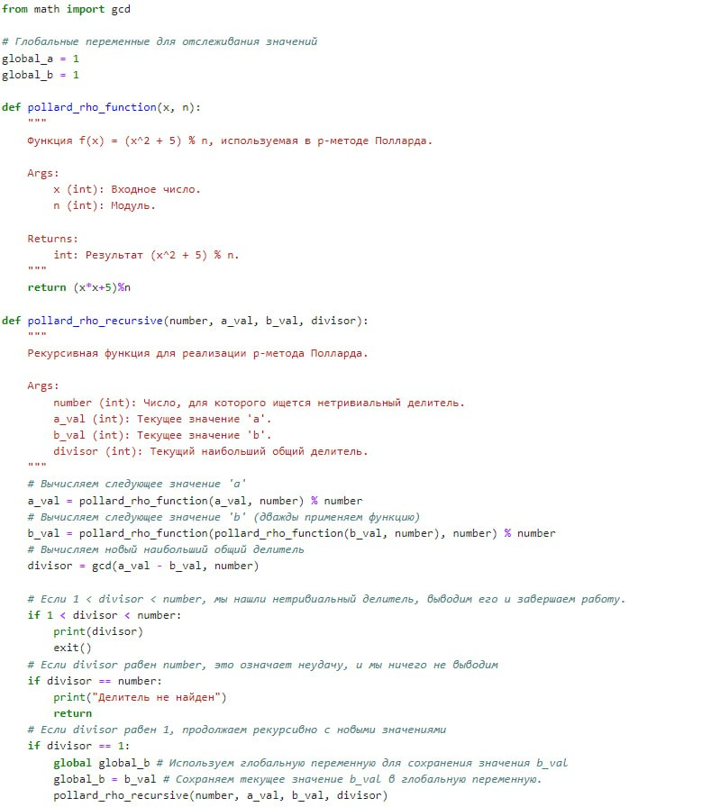

---
## Front matter
lang: ru-RU
title:  лабораторной работе №1
author: Алгайли Абдулазиз Мохаммед
institute: РУДН, Москва, Россия

date: 25 Сентября 2024

## Formatting
toc: false
slide_level: 2
theme: metropolis
header-includes: 
 - \metroset{progressbar=frametitle,sectionpage=progressbar,numbering=fraction}
 - '\makeatletter'
 - '\beamer@ignorenonframefalse'
 - '\makeatother'
aspectratio: 43
section-titles: true
---

| **Дисциплина** | **Лабораторная**| **ФИО** |
| ------ | ------ | ------- |
| Математические основы защиты информации и информационной безопасности|  №6| Александра Миличевич |

##Цель лабораторной работы

Цель лабораторной работы №6 заключается в ознакомлении студентов с p-методом Полларда для факторизации составных чисел. Студенты должны изучить и реализовать алгоритм, который позволяет находить нетривиальные делители чисел, а также понять его применение в криптографии и теории чисел. 

## p-метод Полларда для факторизации чисел

Этот документ описывает реализацию p-метода Полларда, алгоритма для факторизации (нахождения нетривиального делителя) составных чисел.

### 1. Функция `pollard_rho_function(x, n)`

Эта функция реализует функцию f(x) = (x^2 + 5) % n, которая используется внутри p-метода Полларда.

#### Описание:
*   **Вход:**
    *   `x` (int): Целое число, входное значение.
    *   `n` (int): Модуль, целое число.
*   **Выход:**
    *   Результат вычисления `(x^2 + 5) % n`.

#### Как работает:
Функция вычисляет значение выражения `(x^2 + 5) % n` и возвращает его. Эта функция служит для итеративного применения внутри p-метода Полларда, генерируя последовательность чисел.

### 2. Функция `pollard_rho_recursive(number, a_val, b_val, divisor)`

Эта функция реализует p-метод Полларда рекурсивно для поиска нетривиального делителя числа.

#### Описание:
*   **Вход:**
    *   `number` (int): Число, для которого нужно найти нетривиальный делитель.
    *   `a_val` (int): Текущее значение переменной 'a'.
    *   `b_val` (int): Текущее значение переменной 'b'.
    *   `divisor` (int): Текущий наибольший общий делитель (НОД).
*   **Выход:**
    *   Функция не возвращает значения напрямую, но выводит нетривиальный делитель, если он найден, и завершает работу. Если делитель не найден, функция выводит сообщение и завершает работу.

#### Как работает:

1.  **Обновление значений:** Вычисляются новые значения `a_val` и `b_val` путем итеративного применения функции `pollard_rho_function`. Значение `b_val` обновляется дважды за итерацию.
2.  **Вычисление НОД:** Вычисляется наибольший общий делитель (НОД) между разностью `a_val` и `b_val` и исходным числом `number` с помощью функции `gcd` из модуля `math`.
3.  **Проверка делителя:**
    *   Если `divisor` находится между 1 и `number` (1 < divisor < number), значит, найден нетривиальный делитель. Функция выводит этот делитель и завершает выполнение программы.
    *   Если `divisor` равен `number`, то это означает неудачу, и функция выводит сообщение об этом.
    *   Если `divisor` равен 1, это означает, что на текущей итерации делитель не найден, и функция продолжает свою работу рекурсивно.
4.  **Использование глобальной переменной:**
     *   Перед рекурсивным вызовом, текущее значение `b_val` сохраняется в глобальной переменной `global_b`, что позволяет отслеживать значение `b_val` между рекурсивными вызовами.
     *   `global_b` объявляется как глобальная переменная внутри функции с помощью ключевого слова `global`.

#### Глобальные переменные

*   `global_a`: Глобальная переменная для хранения начального значения переменной `a` (инициализирована значением 1).
*  `global_b`: Глобальная переменная для хранения текущего значения переменной `b` (инициализирована значением 1).

### Пример использования

Следующий код инициализирует параметры для p-метода Полларда и запускает поиск делителя.

{ width=70% }

#Вывод
Эта лабораторная  представляет собой набор инструментов для работы с числами, шифрованием, проверкой простоты и факторизацией, которые часто используются в криптографии и теории чисел.
