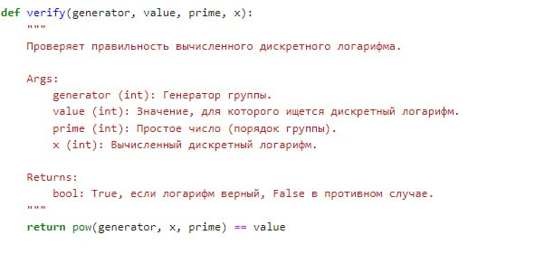

---
## Front matter
lang: ru-RU
title:  Лабораторная работа №7
subtitle: Презентация
author:
  -  Миличевич Александра
institute:
  - Российский университет дружбы народов, Москва, Россия
  
date: 15 февраля 2025

## i18n babel
babel-lang: russian
babel-otherlangs: english

## Formatting pdf
toc: false
toc-title: Содержание
slide_level: 2
aspectratio: 169
section-titles: true
theme: metropolis
header-includes:
 - \metroset{progressbar=frametitle,sectionpage=progressbar,numbering=fraction}
 - '\makeatletter'
 - '\beamer@ignorenonframefalse'
 - '\makeatother'
---

## Цель лабораторной работы 

Цель лабораторной работы №7 заключается в ознакомлении студентов с алгоритмом Полларда для дискретного логарифмирования. 
Студенты должны изучить и реализовать алгоритм, который позволяет находить дискретные логарифмы в конечных полях, а также понять его применение в криптографии и теории чисел. 

---

**P-алгоритм Поллрада** — 
это метод для вычисления дискретного логарифма в конечных полях, который основан на идее разбиения задачи на более простые подзадачи. 
Алгоритм использует метод "разделяй и властвуй", комбинируя два подхода: метод грубой силы и метод "смешивания" (baby-step giant-step). 
Он строит таблицу значений для малых степеней и 
использует их для нахождения соответствующих значений для больших степеней, что значительно ускоряет процесс. 
P-алгоритм Поллрада эффективен для больших чисел и широко применяется в криптографии, особенно в системах, основанных на эллиптических кривых.

---

## 1. Функция `modular_inverse(a, n)`

Эта функция вычисляет обратное к `a` по модулю `n`.

**Описание:**

**Вход:**

- `a` (int): Число, для которого ищется обратное.
- `n` (int): Модуль.

**Выход:**

Обратное к `a` по модулю `n`.

---

**Как работает:**

1. Используется функция `extended_euclidean(a, n)` для получения коэффициентов Безу.
2. Возвращается коэффициент `x` (второй элемент в кортеже), который является обратным к `a` по модулю `n`.
2.  Возвращается коэффициент `x` (второй элемент в кортеже), который является обратным к `a` по модулю `n`.

---

{ width=70% }

---

## 2. Функция `pollard_step(x, a, b, params)`

Эта функция реализует один шаг алгоритма Полларда для дискретного логарифмирования.

**Описание:**

**Вход:**

- `x` (int): Текущее значение `x`.
- `a` (int): Текущее значение `a`.
- `b` (int): Текущее значение `b`.
- `params` (tuple): Параметры (G, H, P, Q).

**Выход:**

Кортеж обновленных значений `(x, a, b)`.

---

**Как работает:**

**Разделение на подмножества:** 

Использует `x % 3` для определения подмножества.

**Обновление значений в зависимости от подмножества:**

- Если `x % 3 == 0`: `x` умножается на `G` по модулю `P`, `a` увеличивается на 1 по модулю `Q`.
- Если `x % 3 == 1`: `x` умножается на `H` по модулю `P`, `b` увеличивается на 1 по модулю `Q`.
- Если `x % 3 == 2`: `x` возводится в квадрат по модулю `P`, `a` и `b` умножаются на 2 по модулю `Q`.

---

{ width=70% }

---

## 3. Функция `pollard_rho_discrete_log(generator, value, prime)`

Эта функция реализует алгоритм Полларда для дискретного логарифмирования.

**Описание:**

**Вход:**

- `generator` (int): Генератор группы.
- `value` (int): Значение, для которого ищется дискретный логарифм.
- `prime` (int): Простое число (порядок группы).

**Выход:**

Дискретный логарифм (если найден) или сообщение об ошибке.

---

**Как работает:**

**Инициализация:**

Устанавливаются начальные значения `Q`, `x`, `a`, `b`, `X`, `A`, `B`.

**Основной цикл:**

- Используются "заяц" и "черепаха" для поиска коллизии, где заяц делает два шага за итерацию, а черепаха - один.
- Функция `pollard_step` применяется для каждого шага.
- Цикл выполняется до тех пор, пока не будет найдена коллизия (`x == X`).

**Вычисление дискретного логарифма:**

- Вычисляется числитель `a - A` и знаменатель `B - b`.
- Вычисляется обратный элемент знаменателя по модулю `Q` с помощью функции `modular_inverse`.
- Вычисляется дискретный логарифм: `(inverse_denominator * numerator) % Q`.

---

{ width=70% }

---

## Функция `verify(generator, value, prime, x)`

Эта функция проверяет правильность вычисленного дискретного логарифма.

**Описание:**

**Вход:**

- `generator` (int): Генератор группы.
- `value` (int): Значение, для которого ищется дискретный логарифм.
- `prime` (int): Простое число (порядок группы).
- `x` (int): Вычисленный дискретный логарифм.

**Выход:**

`True`, если логарифм верный, `False` в противном случае.

---

{ width=70% }

---

## Вывод

Изучили задачу дискретного логарифмирования.