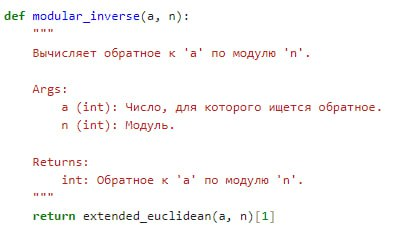
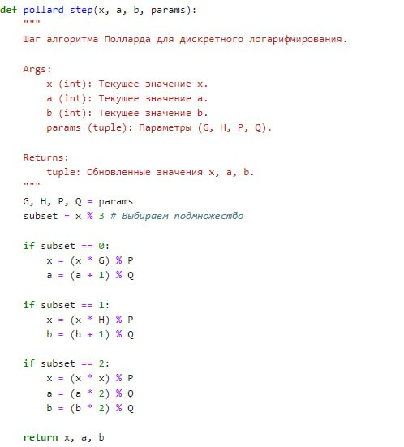
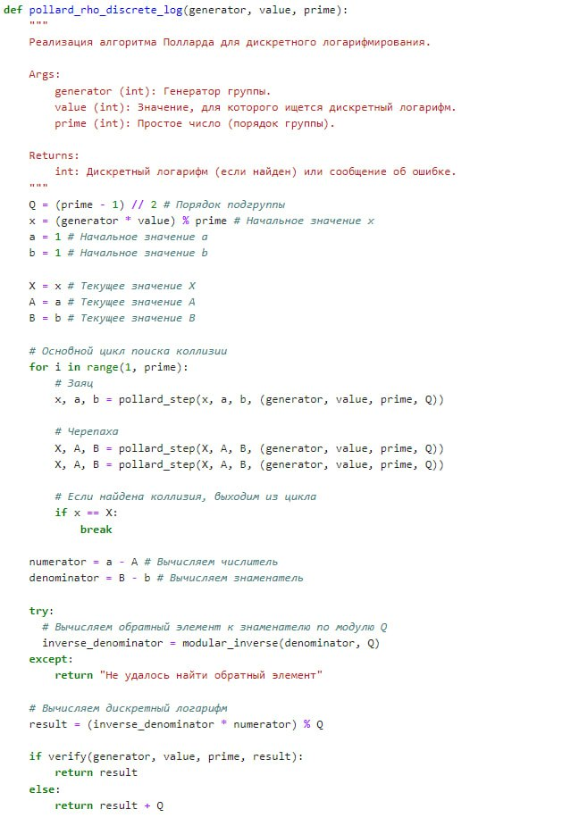
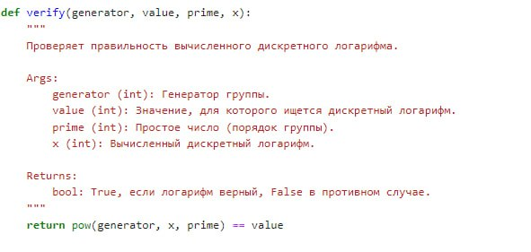

---
## Front matter
title: "Шаблон отчёта по лабораторной работе №7"
subtitle: "Дисциплина: Математические основы защиты информации и информационной безопасности"
author: "Миличевич Александра"

## Generic otions
lang: ru-RU
toc-title: "Содержание"

## Bibliography
bibliography: bib/cite.bib
csl: pandoc/csl/gost-r-7-0-5-2008-numeric.csl

## Pdf output format
toc: true # Table of contents
toc-depth: 2
lof: true # List of figures
lot: true # List of tables
fontsize: 12pt
linestretch: 1.5
papersize: a4
documentclass: scrreprt
## I18n polyglossia
polyglossia-lang:
  name: russian
  options:
	- spelling=modern
	- babelshorthands=true
polyglossia-otherlangs:
  name: english
## I18n babel
babel-lang: russian
babel-otherlangs: english
## Fonts
mainfont: IBM Plex Serif
romanfont: IBM Plex Serif
sansfont: IBM Plex Sans
monofont: IBM Plex Mono
mathfont: STIX Two Math
mainfontoptions: Ligatures=Common,Ligatures=TeX,Scale=0.94
romanfontoptions: Ligatures=Common,Ligatures=TeX,Scale=0.94
sansfontoptions: Ligatures=Common,Ligatures=TeX,Scale=MatchLowercase,Scale=0.94
monofontoptions: Scale=MatchLowercase,Scale=0.94,FakeStretch=0.9
mathfontoptions:
## Biblatex
biblatex: true
biblio-style: "gost-numeric"
biblatexoptions:
  - parentracker=true
  - backend=biber
  - hyperref=auto
  - language=auto
  - autolang=other*
  - citestyle=gost-numeric
## Pandoc-crossref LaTeX customization
figureTitle: "Рис."
tableTitle: "Таблица"
listingTitle: "Листинг"
lofTitle: "Список иллюстраций"
lotTitle: "Список таблиц"
lolTitle: "Листинги"
## Misc options
indent: true
header-includes:
  - \usepackage{indentfirst}
  - \usepackage{float} # keep figures where there are in the text
  - \floatplacement{figure}{H} # keep figures where there are in the text
---

##Цель лабораторной работы 

Цель лабораторной работы №7 заключается в ознакомлении студентов с алгоритмом Полларда для дискретного логарифмирования. Студенты должны изучить и реализовать алгоритм, который позволяет находить дискретные логарифмы в конечных полях, а также понять его применение в криптографии и теории чисел. 

#### Как работает:

1.  **Базовый случай:** Если `b` равно 0, возвращается кортеж `(a, 1, 0)`.
2.  **Рекурсия:** Рекурсивно вызывается `extended_euclidean(b, a % b)`, результат разворачивается, и вычисляются новые коэффициенты `x` и `y`.

### 1. Функция `modular_inverse(a, n)`

Эта функция вычисляет обратное к `a` по модулю `n`.

#### Описание:

*   **Вход:**
    *   `a` (int): Число, для которого ищется обратное.
    *   `n` (int): Модуль.
*   **Выход:**
    *   Обратное к `a` по модулю `n`.

#### Как работает:

1.  Используется функция `extended_euclidean(a, n)` для получения коэффициентов Безу.
2.  Возвращается коэффициент `x` (второй элемент в кортеже), который является обратным к `a` по модулю `n`.
{#fig:001 width=70%}

### 2. Функция `pollard_step(x, a, b, params)`

Эта функция реализует один шаг алгоритма Полларда для дискретного логарифмирования.

#### Описание:
*   **Вход:**
    *   `x` (int): Текущее значение `x`.
    *   `a` (int): Текущее значение `a`.
    *   `b` (int): Текущее значение `b`.
    *   `params` (tuple): Параметры (G, H, P, Q).
*  **Выход:**
    *   Кортеж обновленных значений `(x, a, b)`.

#### Как работает:

1. **Разделение на подмножества:** Использует `x % 3` для определения подмножества.
2. **Обновление значений в зависимости от подмножества:**
   * Если `x % 3 == 0`: `x` умножается на `G` по модулю `P`, `a` увеличивается на 1 по модулю `Q`.
   * Если `x % 3 == 1`: `x` умножается на `H` по модулю `P`, `b` увеличивается на 1 по модулю `Q`.
   * Если `x % 3 == 2`: `x` возводится в квадрат по модулю `P`, `a` и `b` умножаются на 2 по модулю `Q`.

{#fig:002 width=70%}

### 3. Функция `pollard_rho_discrete_log(generator, value, prime)`

Эта функция реализует алгоритм Полларда для дискретного логарифмирования.

#### Описание:

*   **Вход:**
    *   `generator` (int): Генератор группы.
    *   `value` (int): Значение, для которого ищется дискретный логарифм.
    *   `prime` (int): Простое число (порядок группы).
*   **Выход:**
    *   Дискретный логарифм (если найден) или сообщение об ошибке.

#### Как работает:

1.  **Инициализация:** Устанавливаются начальные значения `Q`, `x`, `a`, `b`, `X`, `A`, `B`.
2.  **Основной цикл:**
    *   Используются "заяц" и "черепаха" для поиска коллизии, где заяц делает два шага за итерацию, а черепаха - один.
    *   Функция `pollard_step` применяется для каждого шага.
    *   Цикл выполняется до тех пор, пока не будет найдена коллизия (`x == X`).
3.  **Вычисление дискретного логарифма:**
    *   Вычисляется числитель `a - A` и знаменатель `B - b`.
    *   Вычисляется обратный элемент знаменателя по модулю `Q` с помощью функции `modular_inverse`.
    *   Вычисляется дискретный логарифм: `(inverse_denominator * numerator) % Q`.
4.  **Верификация:** Вызывается функция `verify` для проверки правильности найденного логарифма.
    *   Если логарифм верный, то он возвращается.
    *   Если логарифм не верный (при `pow(generator, result, prime) != value`), то `result` увеличивается на `Q` и возвращается.

{#fig:003 width=70%}

### 4. Функция `verify(generator, value, prime, x)`

Эта функция проверяет правильность вычисленного дискретного логарифма.

#### Описание:

*   **Вход:**
    *   `generator` (int): Генератор группы.
    *   `value` (int): Значение, для которого ищется дискретный логарифм.
    *   `prime` (int): Простое число (порядок группы).
    *   `x` (int): Вычисленный дискретный логарифм.
*   **Выход:**
    *   `True`, если логарифм верный, `False` в противном случае.

{#fig:004 width=70%}

#### Как работает:

1. Вычисляет `generator^x mod prime`.
2. Сравнивает с `value`. Возвращает `True`, если равны, иначе `False`.

