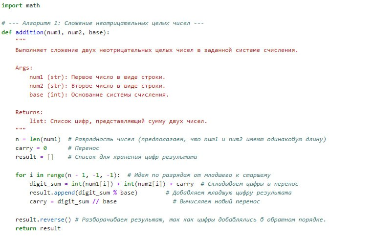
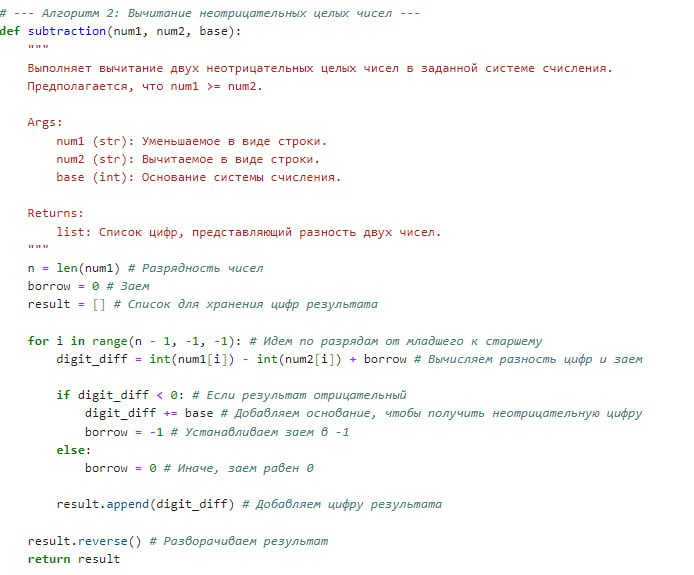
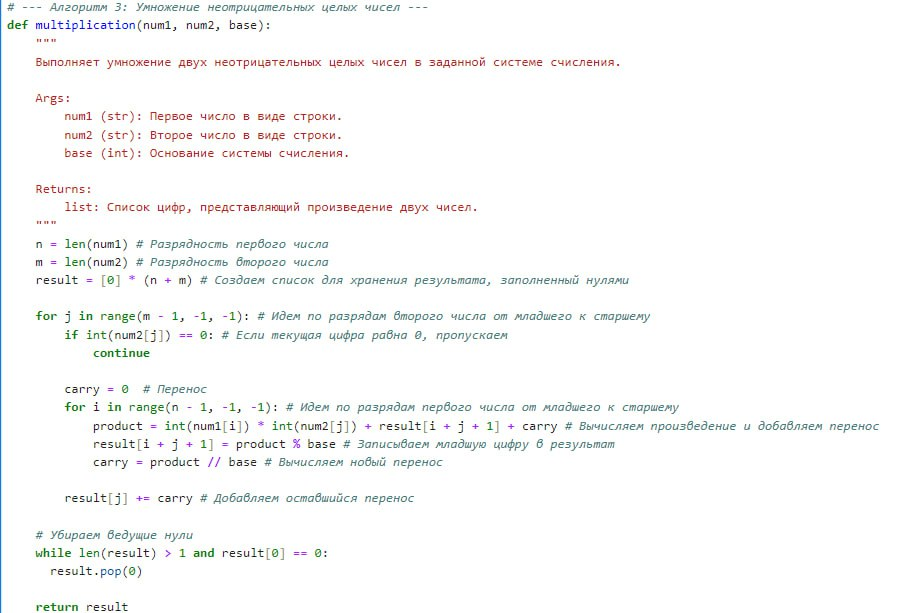
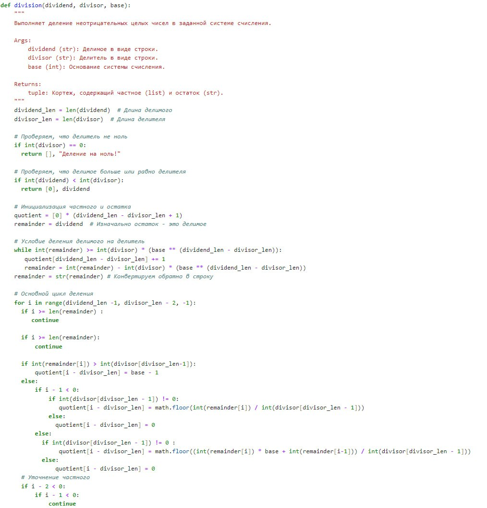

---
## Front matter
lang: ru-RU
title:  Лабораторная работа №8
subtitle: Презентация
author:
  -  Миличевич Александра
institute:
  - Российский университет дружбы народов, Москва, Россия
  
date: 15 февраля 2025

## i18n babel
babel-lang: russian
babel-otherlangs: english

## Formatting pdf
toc: false
toc-title: Содержание
slide_level: 2
aspectratio: 169
section-titles: true
theme: metropolis
header-includes:
 - \metroset{progressbar=frametitle,sectionpage=progressbar,numbering=fraction}
 - '\makeatletter'
 - '\beamer@ignorenonframefalse'
 - '\makeatother'
---

## Цель работы

### Арифметика в системах счисления

Ознакомление с алгоритмами целочисленной арифметики многократной точности, а также их последующая программная реализация.

---

## Длинная арифметика

Высокоточная (длинная) арифметика — это операции (базовые арифметические действия, 
элементарные математические функции и пр.) над числами большой разрядности 
(многоразрядными числами), т.е. числами, разрядность которых превышает 
длину машинного слова универсальных процессоров общего назначения (более 128 бит).

---

## Арифметическое сложение 

Арифметическое сложение неотрицательных чисел — это операция, при которой два числа складываются 
поразрядно, начиная с младших разрядов. Если сумма цифр в текущем разряде превышает основание системы счисления, 
происходит перенос единицы в следующий, более старший разряд. 
Результатом сложения является новое число, представленное в той же системе счисления.
 Этот процесс повторяется для всех разрядов, включая возможный перенос на последнем шаге.

---

## 1. Функция `addition(num1, num2, base)`

**Описание:**

**Вход:**
- `num1` (str): Первое число в виде строки.
- `num2` (str): Второе число в виде строки.
- `base` (int): Основание системы счисления.

**Выход:**
- `list`: Список цифр, представляющий сумму двух чисел.

**Как работает:**
1. **Инициализация:**
   - Определяется разрядность чисел `n`.
   - Переменная `carry` устанавливается в 0.
   - Создается пустой список `result`.

2. **Цикл по разрядам:**
   - Цикл проходит по разрядам чисел от младшего к старшему.
   - На каждой итерации:
     - Вычисляется сумма цифр и перенос.
     - Младшая цифра результата добавляется в `result`.
     - Вычисляется новый перенос.
     
---

3. **Разворот результата:** Список `result` разворачивается.

4. **Возврат результата:** Возвращается список `result`.

{ width=70% }

---

## Арифметическое вычитание 

Арифметическое вычитание неотрицательных чисел — это операция, при которой из одного числа (уменьшаемого) вычитается 
другое число (вычитаемое) поразрядно, начиная с младших разрядов. 
Если цифра в уменьшаемом меньше цифры в вычитаемом, происходит заимствование единицы из следующего, более старшего разряда. 
Результатом вычитания является новое число, которое может быть меньше исходного или равно нулю. Э
тот процесс повторяется для всех разрядов, включая возможное заимствование на каждом шаге.

---

## 2. Функция `subtraction(num1, num2, base)`

**Описание:**

**Вход:**
- `num1` (str): Уменьшаемое в виде строки.
- `num2` (str): Вычитаемое в виде строки.
- `base` (int): Основание системы счисления.

**Выход:**
- `list`: Список цифр, представляющий разность двух чисел.

**Как работает:**
1. **Инициализация:**
   - Определяется разрядность чисел `n`.
   - Переменная `borrow` устанавливается в 0.
   - Создается пустой список `result`.

2. **Цикл по разрядам:**
   - Цикл проходит по разрядам чисел от младшего к старшему.
   - На каждой итерации:
     - Вычисляется разность цифр и заем.
     - Цифра результата добавляется в `result`.

---

3. **Разворот результата:** Список `result` разворачивается.

4. **Возврат результата:** Возвращается список `result`.

{ width=70% }

---

## Арифметическое умножение неотрицательных чисел по столбику 

Арифметическое умножение неотрицательных чисел по столбику — это операция, при которой одно число (множимое) у
множается на каждую цифру другого числа (множителя) по отдельности, начиная с младшего разряда. 
Результаты каждого умножения записываются со сдвигом влево на соответствующее количество разрядов, после чего все промежуточные результаты складываются.
 Если произведение цифр превышает основание системы счисления, старшая часть записывается как перенос 
 и добавляется к следующему разряду. Итогом является новое число, представляющее произведение исходных чисел.

---

### 3. Функция `multiplication(num1, num2, base)`

Эта функция выполняет умножение двух неотрицательных чисел в заданной системе счисления.

**Описание:**

**Вход:**

  - `num1` (str): Первое число в виде строки.
  - `num2` (str): Второе число в виде строки.
  - `base` (int): Основание системы счисления.
  
**Выход:**

  - `list`: Список цифр, представляющий произведение двух чисел.

**Как работает:**

**Инициализация:**
   - Определяются длины чисел `n` (для `num1`) и `m` (для `num2`).
   - Создается список `result` длиной `n + m`, заполненный нулями, для хранения результата.

---

**Внешний цикл по разрядам второго числа:**

- Цикл `for` проходит по разрядам `num2` от младшего к старшему (справа налево).
- Если текущая цифра `num2[j]` равна 0, то итерация пропускается.

**Внутренний цикл по разрядам первого числа:**

- Цикл `for` проходит по разрядам `num1` от младшего к старшему.

**На каждой итерации:**

- Вычисляется произведение цифр на текущих разрядах и добавляется к предыдущему результату и переносу:  
  `product = int(num1[i]) * int(num2[j]) + result[i + j + 1] + carry`.
- Младшая цифра произведения записывается в `result[i + j + 1]`:  
  `result[i + j + 1] = product % base`.
- Вычисляется новый перенос:  
  `carry = product // base`.

---

{ width=70% }

---

Арифметическое деление неотрицательных чисел — это операция, которая определяет, сколько раз одно число (делимое) может
 быть разделено на другое число (делитель) без остатка. Результатом деления является частное, которое представляет 
 собой количество полных делений, и остаток, который показывает, сколько осталось после деления. 
 Если делимое меньше делителя, то частное равно нулю
, а остаток равен делимому. Деление на ноль не определено и приводит к ошибке, 
так как невозможно разделить число на ноль.

---

## 5. Функция `division(dividend, divisor, base)`

Эта функция выполняет деление неотрицательных целых чисел в заданной системе счисления.

#### Описание:

-**Вход:**

  - `dividend` (str): Делимое в виде строки.
  - `divisor` (str): Делитель в виде строки.
  - `base` (int): Основание системы счисления.
  
**Выход:**

  - `tuple`: Кортеж, содержащий частное (list) и остаток (str).

#### Как работает:

**Инициализация:**
   - Определяется длина делимого `dividend_len` и делителя `divisor_len`.
   - Проверяется, что делитель не равен нулю.
   - Проверяется, что делимое больше или равно делителя.
   - Создается список `quotient` (частное) и присваивается `remainder` значение `dividend`.

---

**Предварительное деление:**

   Выполняется проверка, на случай, если делимое больше делителя на целую степень base.

**Основной цикл деления:**

   Цикл проходит по разрядам делимого (справа налево).
   
**На каждой итерации:**
     Проверяется, что текущий разряд делимого входит в границы остатка.
     Определяется начальное значение для цифры частного.
     Цикл `while` уточняет значение цифры частного.
     Обновляется остаток с учетом новой цифры частного.

**Возврат результата:**

 Возвращается кортеж, содержащий частное (`quotient`) и остаток (`remainder`).

---

{ width=70% }

---

## Заключение

Эта лабораторная описывает функции для выполнения арифметических операций в системах счисления.
