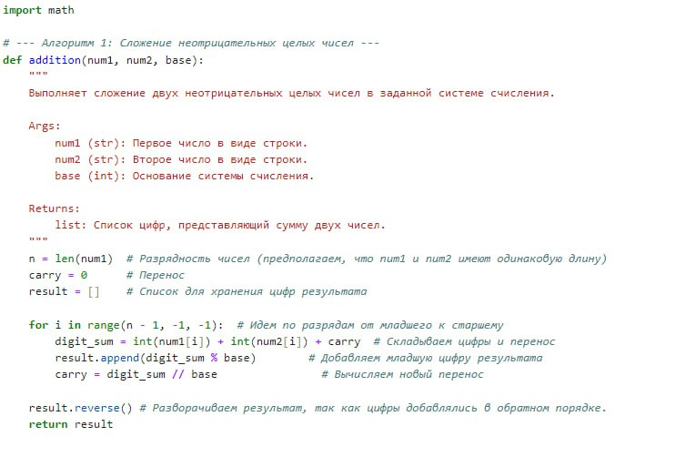
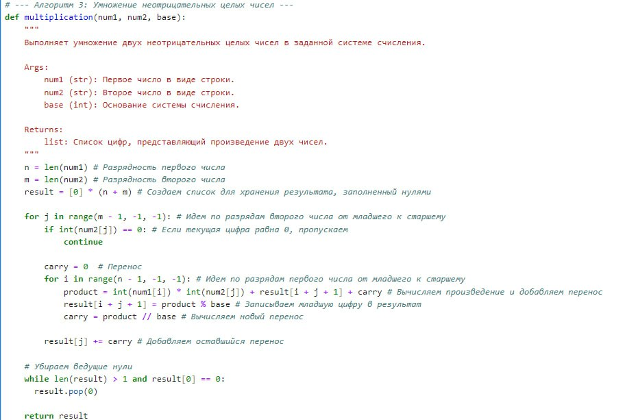
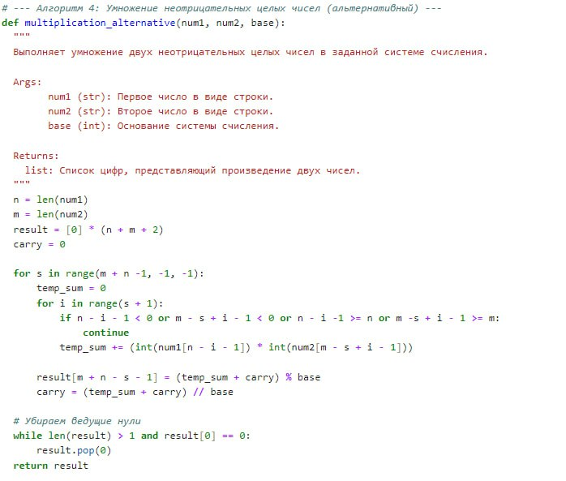
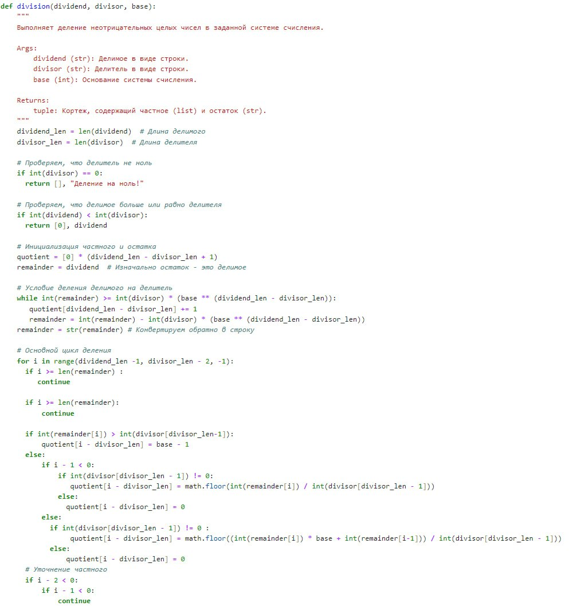

---
## Front matter
title: "Шаблон отчёта по лабораторной работе №1"
subtitle: "Дисциплина: Математические основы защиты информации и информационной безопасности"
author: "Миличевич Александра"

## Generic otions
lang: ru-RU
toc-title: "Содержание"

## Bibliography
bibliography: bib/cite.bib
csl: pandoc/csl/gost-r-7-0-5-2008-numeric.csl

## Pdf output format
toc: true # Table of contents
toc-depth: 2
lof: true # List of figures
lot: true # List of tables
fontsize: 12pt
linestretch: 1.5
papersize: a4
documentclass: scrreprt
## I18n polyglossia
polyglossia-lang:
  name: russian
  options:
	- spelling=modern
	- babelshorthands=true
polyglossia-otherlangs:
  name: english
## I18n babel
babel-lang: russian
babel-otherlangs: english
## Fonts
mainfont: IBM Plex Serif
romanfont: IBM Plex Serif
sansfont: IBM Plex Sans
monofont: IBM Plex Mono
mathfont: STIX Two Math
mainfontoptions: Ligatures=Common,Ligatures=TeX,Scale=0.94
romanfontoptions: Ligatures=Common,Ligatures=TeX,Scale=0.94
sansfontoptions: Ligatures=Common,Ligatures=TeX,Scale=MatchLowercase,Scale=0.94
monofontoptions: Scale=MatchLowercase,Scale=0.94,FakeStretch=0.9
mathfontoptions:
## Biblatex
biblatex: true
biblio-style: "gost-numeric"
biblatexoptions:
  - parentracker=true
  - backend=biber
  - hyperref=auto
  - language=auto
  - autolang=other*
  - citestyle=gost-numeric
## Pandoc-crossref LaTeX customization
figureTitle: "Рис."
tableTitle: "Таблица"
listingTitle: "Листинг"
lofTitle: "Список иллюстраций"
lotTitle: "Список таблиц"
lolTitle: "Листинги"
## Misc options
indent: true
header-includes:
  - \usepackage{indentfirst}
  - \usepackage{float} # keep figures where there are in the text
  - \floatplacement{figure}{H} # keep figures where there are in the text
---

##Цель работы
###Арифметика в системах счисления: Сложение , Вычитание, Умножение и деление

Этот документ описывает реализацию алгоритмов сложения и вычитания неотрицательных целых чисел в заданной системе счисления.

### 1. Функция `addition(num1, num2, base)`

Эта функция выполняет сложение двух неотрицательных целых чисел в заданной системе счисления.

#### Описание:

*   **Вход:**
    *   `num1` (str): Первое число в виде строки.
    *   `num2` (str): Второе число в виде строки.
    *   `base` (int): Основание системы счисления.
*   **Выход:**
    *   `list`: Список цифр, представляющий сумму двух чисел.

#### Как работает:

1.  **Инициализация:**
    *   Определяется разрядность чисел `n` (длина `num1`, предполагается, что `num1` и `num2` имеют одинаковую длину).
    *   Переменная `carry` (перенос) устанавливается в 0.
    *   Создается пустой список `result` для хранения цифр результата.
2.  **Цикл по разрядам:**
    *   Цикл `for` проходит по разрядам чисел от младшего к старшему (справа налево).
    *   На каждой итерации:
        *   Вычисляется сумма цифр на текущем разряде и перенос: `digit_sum = int(num1[i]) + int(num2[i]) + carry`.
        *   Младшая цифра результата добавляется в список `result`: `result.append(digit_sum % base)`.
        *   Вычисляется новый перенос: `carry = digit_sum // base`.
3.  **Разворот результата:** Список `result` разворачивается, так как цифры добавлялись в обратном порядке.
4.  **Возврат результата:** Возвращается список `result`, представляющий сумму чисел.
{#fig:001 width=70%}
### 2. Функция `subtraction(num1, num2, base)`

Эта функция выполняет вычитание двух неотрицательных целых чисел в заданной системе счисления. Предполагается, что `num1 >= num2`.

#### Описание:

*   **Вход:**
    *   `num1` (str): Уменьшаемое в виде строки.
    *   `num2` (str): Вычитаемое в виде строки.
    *   `base` (int): Основание системы счисления.
*   **Выход:**
    *  `list`: Список цифр, представляющий разность двух чисел.

#### Как работает:

1.  **Инициализация:**
    *   Определяется разрядность чисел `n` (длина `num1`).
    *   Переменная `borrow` (заем) устанавливается в 0.
    *   Создается пустой список `result` для хранения цифр результата.
2.  **Цикл по разрядам:**
    *   Цикл `for` проходит по разрядам чисел от младшего к старшему (справа налево).
    *   На каждой итерации:
        *   Вычисляется разность цифр на текущем разряде и заем: `digit_diff = int(num1[i]) - int(num2[i]) + borrow`.
        *   Если `digit_diff` отрицателен:
            *   К `digit_diff` добавляется основание, чтобы получить неотрицательную цифру: `digit_diff += base`.
            *   Устанавливается заем в -1: `borrow = -1`.
        *   Иначе (если `digit_diff` неотрицателен):
            *   Устанавливается заем в 0: `borrow = 0`.
        *   Цифра результата добавляется в список `result`: `result.append(digit_diff)`.
3.  **Разворот результата:** Список `result` разворачивается.
4.  **Возврат результата:** Возвращается список `result`, представляющий разность чисел.

{#fig:002 width=70%}

### 3. Функция `multiplication(num1, num2, base)`

Эта функция выполняет умножение двух неотрицательных целых чисел в заданной системе счисления.

#### Описание:

*   **Вход:**
    *   `num1` (str): Первое число в виде строки.
    *   `num2` (str): Второе число в виде строки.
    *   `base` (int): Основание системы счисления.
*   **Выход:**
    *  `list`: Список цифр, представляющий произведение двух чисел.

#### Как работает:

1.  **Инициализация:**
    *   Определяется разрядность чисел `n` и `m` (длины `num1` и `num2` соответственно).
    *   Создается список `result` длиной `n + m`, заполненный нулями, для хранения результата.
2.  **Внешний цикл по разрядам второго числа:**
    *   Цикл `for` проходит по разрядам `num2` от младшего к старшему (справа налево).
    *   Если текущая цифра `num2[j]` равна 0, то итерация пропускается.
3.  **Внутренний цикл по разрядам первого числа:**
    *   Цикл `for` проходит по разрядам `num1` от младшего к старшему.
    *   На каждой итерации:
        *   Вычисляется произведение цифр на текущих разрядах и добавляется к предыдущему результату и переносу: `product = int(num1[i]) * int(num2[j]) + result[i + j + 1] + carry`.
        *   Младшая цифра произведения записывается в `result[i + j + 1]`: `result[i + j + 1] = product % base`.
        *   Вычисляется новый перенос: `carry = product // base`.
4.  **Добавление переноса:** Оставшийся перенос `carry` добавляется к `result[j]`.
5.  **Удаление ведущих нулей:** Убираются ведущие нули из `result` (если есть).
6.  **Возврат результата:** Возвращается список `result`, представляющий произведение чисел.
{#fig:003 width=70%}

### 4. Функция `multiplication_alternative(num1, num2, base)`
Эта функция выполняет альтернативный алгоритм умножения двух неотрицательных целых чисел в заданной системе счисления.

#### Описание:
*  **Вход:**
    *   `num1` (str): Первое число в виде строки.
    *  `num2` (str): Второе число в виде строки.
    *  `base` (int): Основание системы счисления.
*   **Выход:**
    *   `list`: Список цифр, представляющий произведение двух чисел.
#### Как работает:
1. **Инициализация:**
    * Определяется разрядность чисел `n` и `m` (длины `num1` и `num2` соответственно).
    * Создается список `result` длиной `n + m + 2`, заполненный нулями, для хранения результата.
    * Переменная `carry` устанавливается в 0.
2.  **Внешний цикл по суммам разрядов:**
    * Цикл `for` проходит по всем возможным суммам разрядов.
    * На каждой итерации вычисляется `temp_sum` как сумма произведений соответствующих цифр из `num1` и `num2`.
    * Текущая цифра результата вычисляется как `(temp_sum + carry) % base` и записывается в `result`.
    * `carry` обновляется как `(temp_sum + carry) // base`.
3.  **Удаление ведущих нулей:** Убираются ведущие нули из `result` (если есть).
4. **Возврат результата:** Возвращается список `result`, представляющий произведение чисел.

{#fig:004 width=70%}

### 5. Функция `division(dividend, divisor, base)`

Эта функция выполняет деление неотрицательных целых чисел в заданной системе счисления.

#### Описание:

*   **Вход:**
    *   `dividend` (str): Делимое в виде строки.
    *   `divisor` (str): Делитель в виде строки.
    *   `base` (int): Основание системы счисления.
*   **Выход:**
    *   `tuple`: Кортеж, содержащий частное (list) и остаток (str).

#### Как работает:

1.  **Инициализация:**
    *   Определяется длина делимого `dividend_len` и делителя `divisor_len`.
    *   Проверяется, что делитель не равен нулю.
    *   Проверяется, что делимое больше или равно делителя.
    *   Создается список `quotient` (частное) и присваивается `remainder` значение `dividend`.
2.  **Предварительное деление:**
   *   Выполняется проверка, на случай, если делимое больше делителя на целую степень base. 
3.  **Основной цикл деления:**
    *   Цикл проходит по разрядам делимого (справа налево).
    *   На каждой итерации:
      *  Проверяется, что текущий разряд делимого входит в границы остатка.
      *  Определяется начальное значение для цифры частного.
      *  Цикл `while` уточняет значение цифры частного.
      *  Обновляется остаток с учетом новой цифры частного.
4.  **Возврат результата:** Возвращается кортеж, содержащий частное (`quotient`) и остаток (`remainder`).

{#fig:005 width=70%}
### Заключение

Эта лабораторная описывает функции `addition`, `subtraction`, `multiplication`, `multiplication_alternative`, и `division`, которые выполняют сложение, вычитание, умножение и деление неотрицательных целых чисел в заданной системе счисления. Эти функции используют стандартные алгоритмы для выполнения этих операций, работая с числами, представленными в виде строк цифр.
